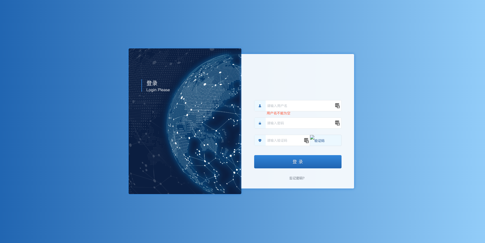
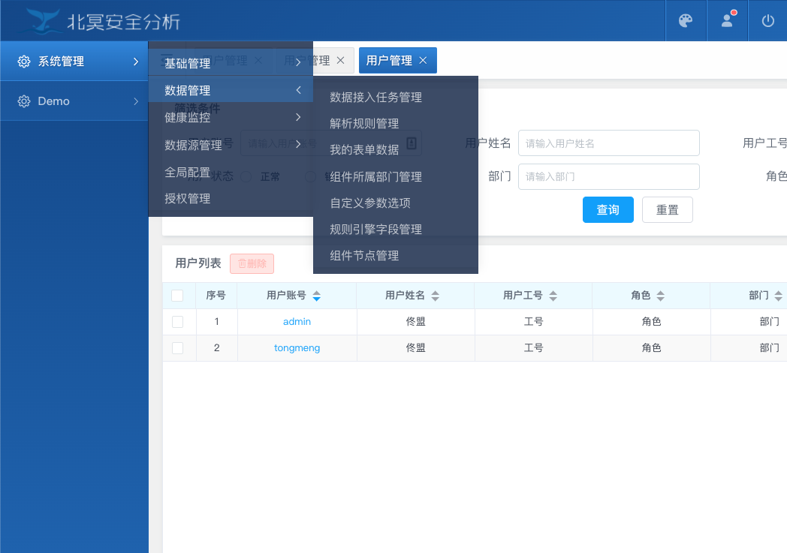
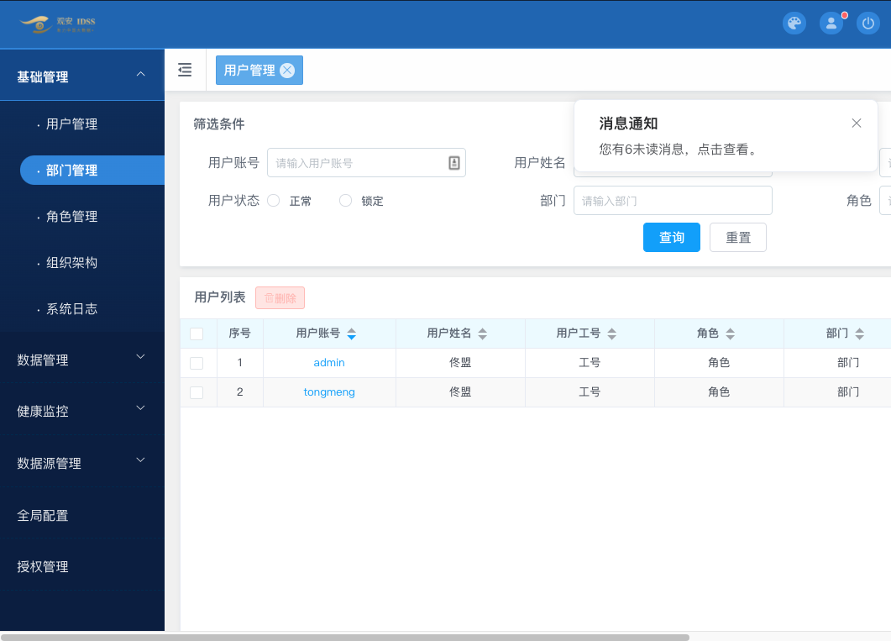
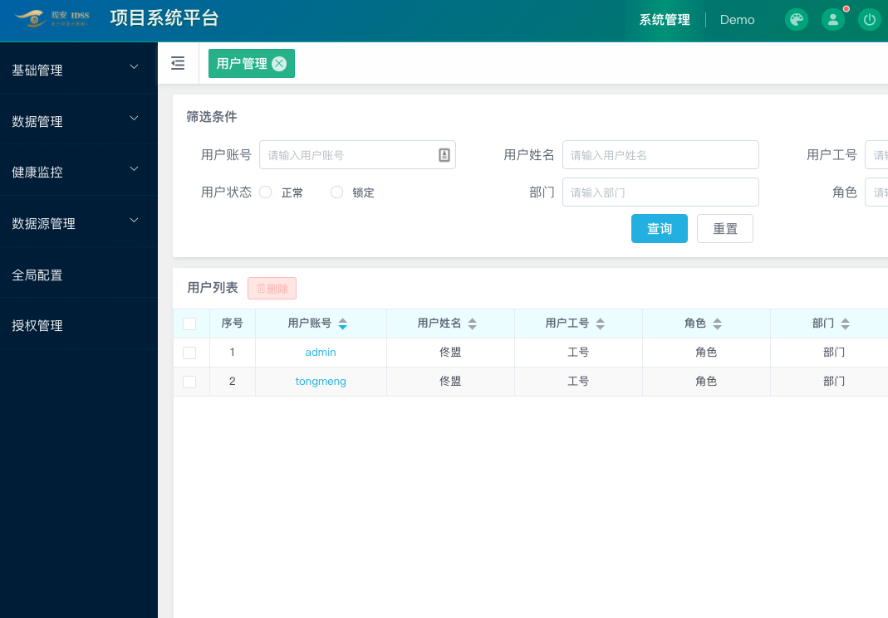

# argus-fe-template
```
前端框架模版
```
### 组件库引用说明
组件库使用git subtree进行管理，大家可通过下述命令进行更新和提交相关组件库
```shell

$ git remote add fusion-charts git@10.10.10.8:IDSS-FE/fusion-charts.git # 添加 fusion-charts 远程地址∂
$ git remote add fusion-components git@10.10.10.8:IDSS-FE/fusion-components.git # 添加 fusion-components 远程地址
$ git remote add fusion-utils git@10.10.10.8:IDSS-FE/fusion-utils.git # 添加 fusion-utils 远程地址

# 添加
$ git subtree add --prefix=src/fusion-charts fusion-charts master
$ git subtree add --prefix=src/fusion-components fusion-components master
$ git subtree add --prefix=src/fusion-utils fusion-utils master

# 获取 
$ git subtree pull --prefix=src/fusion-charts fusion-charts master
$ git subtree pull --prefix=src/fusion-components fusion-components master
$ git subtree pull --prefix=src/fusion-utils fusion-utils master

# 将最新代码提交到 fusion-charts 工程
$ git subtree split --rejoin --prefix=src/fusion-charts --branch charts-temp
$ git push fusion-charts charts-temp:master
```


## Project setup
```
yarn install
```

### Compiles and hot-reloads for development

```shell
yarn run serve 或 npm run serve
```

### Compiles and minifies for production

```shell
yarn run build 或 npm run build
```

### Run your tests

```shell
yarn run test 或 npm run test
```

### Lints and fixes files

```shell
yarn run lint 或 npm run lint
```

## 方案切换

### 配色方案

替换`src/styles/themes/default/common.css`文件`[data-theme="default"]`内的内容

### 登录方案

#### 登录方案-default


#### [登录方案一](http://192.168.0.135:81/UI%E8%A7%84%E8%8C%83V2.0/html/#id=qhnfrd&p=%E7%99%BB%E5%BD%95%E9%A1%B5%E6%96%B9%E6%A1%88%E4%B8%80&g=1)

推荐配色： `src/styles/themes/guan-blue1/common.css`


#### [登录方案二](http://192.168.0.135:81/UI%E8%A7%84%E8%8C%83V2.0/html/#id=flwi3k&p=%E7%99%BB%E5%BD%95%E9%A1%B5%E6%96%B9%E6%A1%88%E4%BA%8C&g=1)

推荐配色： `src/styles/themes/guan-blue2/common.css`
推荐配色： `src/styles/themes/guan-blue-green/common.css`



### 框架方案

框架方案切换：修改`src/views/layouts/layout.vue`文件

#### [框架方案一](http://192.168.0.135:81/UI%E8%A7%84%E8%8C%83V2.0/html/#id=c3n9gf&p=%E6%A1%86%E6%9E%B6%E6%96%B9%E6%A1%88%E4%B8%80ui%EF%BC%88%E6%94%AF%E6%8C%81%E4%B8%80%E8%87%B3%E5%9B%9B%E7%BA%A7%E8%8F%9C%E5%8D%95%EF%BC%89&g=1)

推荐配色： `src/styles/themes/guan-blue1/common.css`



#### [框架方案二](http://192.168.0.135:81/UI%E8%A7%84%E8%8C%83V2.0/html/#id=2z81i8&p=%E6%A1%86%E6%9E%B6%E6%96%B9%E6%A1%88%E4%BA%8Cui%EF%BC%88%E6%94%AF%E6%8C%81%E4%BA%8C%E7%BA%A7%E8%8F%9C%E5%8D%95%EF%BC%89&g=1)

推荐配色： `src/styles/themes/guan-blue2/common.css`
推荐配色： `src/styles/themes/guan-blue-green/common.css`



#### [框架方案三](http://192.168.0.135:81/UI%E8%A7%84%E8%8C%83V2.0/html/#id=3flocg&p=%E6%A1%86%E6%9E%B6%E6%96%B9%E6%A1%88%E4%B8%89ui%EF%BC%88%E6%94%AF%E6%8C%81%E4%B8%89%E7%BA%A7%E8%8F%9C%E5%8D%95%EF%BC%89&g=1)

推荐配色： `src/styles/themes/guan-blue-green/common.css`



#### [框架方案四](http://192.168.0.135:81/UI%E8%A7%84%E8%8C%83V2.0/html/#id=ay4tkf&p=%E6%A1%86%E6%9E%B6%E6%96%B9%E6%A1%88%E5%9B%9Bui%EF%BC%88%E6%94%AF%E6%8C%81%E4%B8%89%E7%BA%A7%E8%8F%9C%E5%8D%95%EF%BC%89&g=1)

